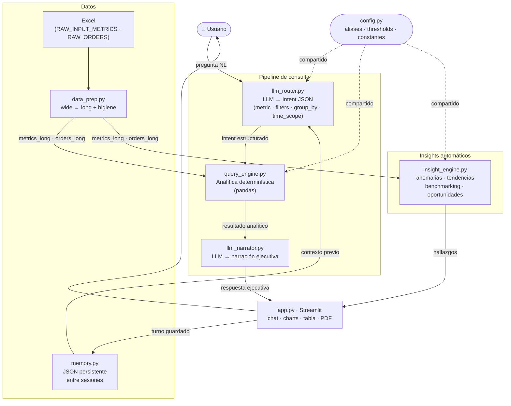
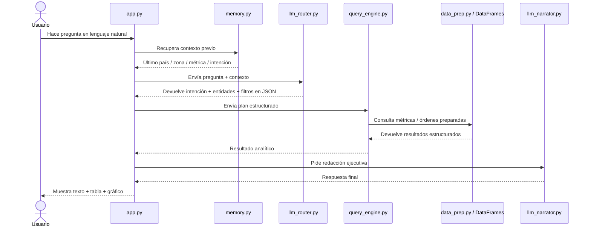

# Rappi AI Operations Assistant

Asistente analitico conversacional para operaciones, construido como challenge tecnico de AI Engineer.

El sistema permite hacer preguntas en lenguaje natural sobre metricas operativas y obtener respuestas ejecutivas con charts, tablas e insights automaticos — sin que el LLM toque un solo numero.

---

## Principio de diseño central

> **El LLM entiende y redacta. pandas calcula.**

Toda la logica numerica vive en el motor deterministico (`query_engine.py`). El LLM recibe la pregunta, produce un JSON estructurado con la intencion, y luego recibe el resultado ya calculado para redactarlo en lenguaje ejecutivo. Esto garantiza:

- reproducibilidad: el mismo input siempre produce el mismo calculo
- auditabilidad: cada respuesta tiene traza tecnica visible
- testabilidad: el motor es 100% determinista y tiene cobertura de tests unitarios

---

## Arquitectura

```
app.py (Streamlit UI)
    ├── memory.py          → contexto conversacional persistente (JSON)
    ├── llm_router.py      → LLM: pregunta NL → intent JSON estructurado
    ├── query_engine.py    → pandas: calculo deterministico
    ├── insight_engine.py  → reglas: anomalias, tendencias, benchmarking
    ├── llm_narrator.py    → LLM: resultado numerico → narrativa ejecutiva
    ├── data_prep.py       → carga Excel, reshape wide→long, higiene
    ├── prompts.py         → prompts del router y narrator
    ├── config.py          → constantes, aliases, thresholds
    └── utils.py           → PDF, display helpers, SMTP
```

### Diagrama de flujo



### Diagrama de secuencia



---

## Decisiones técnicas

### Modelo: gpt-4.1

Se eligio `gpt-4.1` como modelo de produccion por las siguientes razones:

| Criterio | Decision |
|---|---|
| Instruction-following | gpt-4.1 supera a gpt-4o-mini en adherencia a JSON schemas estrictos y reglas de routing complejas |
| Costo | ~$2/M tokens input, ~$8/M tokens output — razonable para el volumen de una app operacional |
| Latencia | Inferior a o3/o4-mini en tareas de clasificacion e instruccion-following sin razonamiento multi-paso |
| Modelos de razonamiento | o3/o4-mini son overkill: este pipeline no requiere razonamiento multi-paso sino clasificacion precisa y redaccion estructurada |
| Alternativas | Claude 3.7 Sonnet y Gemini 2.0 Flash son igualmente capaces; se eligio OpenAI por familiaridad del SDK y para reducir fricción en 48 horas |
| Portabilidad | La arquitectura es model-agnostic — cambiar el modelo es un swap de dos lineas en `.env` sin tocar el pipeline |

**Costo estimado por consulta en produccion:**

- Input medio por consulta: ~600 tokens (prompt sistema ~400 + pregunta ~100 + contexto memoria ~100)
- Output medio por consulta: ~150 tokens (intent JSON ~100 + narracion ~150, dos llamadas)
- Costo estimado: ~$0.002–0.003 USD por consulta end-to-end
- Referencia del desarrollo de este challenge: $1.66 USD / 1.7M tokens / 574 requests ≈ $0.003/request

### Framework: Streamlit

Streamlit permite iterar en horas sobre la UI sin sacrificar la calidad del pipeline analitico. Para un MVP de operaciones orientado a demo, la eleccion es correcta. En produccion, la UI seria un detalle de implementacion — el pipeline router → engine → narrator es agnóstico a la interfaz.

### Motor analitico: pandas sobre SQL

Se eligio pandas en lugar de SQL por:
- los datos son locales (Excel dummy), no hay warehouse
- pandas permite inspeccionar y testear cada transformacion en aislamiento
- la transicion a SQL/BigQuery en produccion es directa: reemplazar `_select_dataset()` en `query_engine.py`

### Python nativo sobre plataformas no-code (n8n, Make, Zapier)

| Criterio | Decision |
|---|---|
| Control del pipeline | Python permite controlar cada paso del flujo (routing → engine → narrator) con logica arbitraria, tests unitarios y trazabilidad completa. Las plataformas no-code abstraen ese control en nodos visuales que no son auditables ni testeables |
| Logica analitica | El motor deterministico en `query_engine.py` requiere pandas, groupby, percentiles y logica condicional compleja. Ninguna plataforma no-code expone ese nivel de expresividad sin caer en "code nodes" que anulan la ventaja |
| Testabilidad | 97 tests corren en segundos sobre el pipeline Python. Un workflow n8n no tiene cobertura de tests estandar |
| Portabilidad | El pipeline es agnóstico a la interfaz: la misma logica puede servirse via Streamlit, FastAPI o CLI sin cambios. Un workflow no-code esta atado a la plataforma |
| Produccion | En produccion real, el pipeline se conectaria a un warehouse (BigQuery, Snowflake) reemplazando una sola funcion. Migrar un workflow n8n es reescribirlo |
| Uso apropiado de no-code | n8n es ideal para integraciones entre SaaS (Slack → Jira → Sheets). Para analitica con LLMs y logica de negocio compleja, Python es la herramienta correcta |

### Manejo de edge cases

| Caso | Manejo |
|---|---|
| LLM devuelve JSON malformado | `parse()` cae al fallback heuristico basado en regex; la app nunca crashea |
| Sin API key configurada | El router usa el parser heuristico; la UI muestra un warning en el sidebar |
| Metrica no existe en el dataset | `status = "no_data"` con mensaje contextual indicando metrica y scope |
| Pregunta sin metrica explicita | Para `anomaly_check`, el engine escanea todas las metricas y retorna la anomalia mas severa |
| Intent ambiguo | `status = "not_implemented"` con sugerencias de reformulacion |
| Variacion > 100% | Flag de "variacion extrema": muestra cambio absoluto en vez de porcentaje para evitar confusion |
| LLM infiere metrica de palabras vagas | Guard en `_sanitize_parsed_output`: si el nombre de la metrica no aparece en la query, se descarta |
| time_scope de una sola semana en anomaly | Safety net en `query_engine.py`: expande automaticamente al rango completo si hay < 2 semanas |
| Duplicado de chart ID en Streamlit | `key=f"chart_{turn_index}"` unico por turno |
| DataFrames en memoria persistida | `last_result` nunca se serializa a JSON; solo se guarda en RAM |

---

## Funcionalidades soportadas

- Metric lookup (ultimo valor disponible con filtros geograficos)
- Trend analysis (evolucion temporal con chart de linea)
- Comparison (ranking entre entidades en snapshot reciente)
- Ranking / Top N adaptable
- Agregaciones por dimension (mean, sum)
- Screening multivariable: `alto X pero bajo Y` con percentiles adaptativos
- Deteccion de anomalias semana-a-semana (multi-metrica cuando no se especifica)
- Deteccion de oportunidades de crecimiento
- Follow-ups con memoria conversacional persistente entre sesiones
- Parsing en español e ingles con glosario de aliases expandido
- Reporte ejecutivo automatico con export PDF

---

## Insights automaticos

El motor de insights genera hallazgos en seis categorias:

- **Anomalias**: variacion semana-a-semana con severidad y flag de variacion extrema
- **Deterioro de tendencia**: 3 semanas consecutivas de caida
- **Benchmarking local**: mejor vs peor zona dentro del mismo pais
- **Benchmarking internacional**: mejor vs peor pais por tipo de zona (cross-country)
- **Correlaciones**: co-movimientos entre metricas en el mismo periodo
- **Oportunidades**: zonas con tendencia positiva sostenida

Todos los thresholds de deteccion estan centralizados en `config.py` y son configurables sin tocar el codigo del engine.

---

## Datos

Fuente: Excel dummy del challenge en `data/raw/`.

Hojas utilizadas: `RAW_INPUT_METRICS`, `RAW_ORDERS`, `RAW_SUMMARY`.

`data_prep.py` genera tablas long (`metrics_long`, `orders_long`) aplicando:

- trim de texto y normalizacion de encoding
- preservacion de nulls reales vs vacios
- coercion numerica del campo `value`
- drop de filas sin semana o valor
- deduplicacion de filas exactas

---

## Setup local

### 1. Entorno virtual

```bash
python -m venv .venv
# Windows PowerShell:
Set-ExecutionPolicy -Scope Process -ExecutionPolicy Bypass
.venv\Scripts\Activate.ps1
# macOS / Linux:
source .venv/bin/activate
```

### 2. Dependencias

```bash
pip install -r requirements.txt
```

### 3. Variables de entorno

Crear `.env` en la raiz:

```env
OPENAI_API_KEY=sk-...
MODEL_NAME=gpt-4.1
```

Si `OPENAI_API_KEY` no esta configurada, el router cae al parser heuristico y la app sigue funcionando con capacidad reducida.

### 4. Datos

Ubicar el Excel en:

```
data/raw/Sistema de Análisis Inteligente para Operaciones Rappi - Dummy Data.xlsx
```

### 5. Correr

```bash
streamlit run app.py
```

### 6. Tests

```bash
pytest -q                          # solo tests unitarios (rapido)
pytest tests/test_pipeline_full.py # integracion end-to-end con LLM (lento)
```

---

## Deploy en Streamlit Cloud

### 1. Subir el repo a GitHub

Verificar que `.env` y `DEMO_SCRIPT.md` esten en `.gitignore` antes de hacer push.

### 2. Crear la app en share.streamlit.io

- Conectar el repo
- Main file: `app.py`

### 3. Configurar secrets

En **Settings → Secrets** de la app en Streamlit Cloud, agregar en formato TOML:

```toml
OPENAI_API_KEY = "sk-..."
MODEL_NAME = "gpt-4.1"

# Opcional — solo si se quiere habilitar envio de reportes por mail
SMTP_HOST = "smtp.gmail.com"
SMTP_PORT = "587"
SMTP_USERNAME = "tu_mail@gmail.com"
SMTP_PASSWORD = "tu_app_password"
SMTP_FROM_EMAIL = "tu_mail@gmail.com"
SMTP_USE_TLS = "true"
```

La app lee los secrets via `st.secrets` como fallback cuando las variables de entorno no estan disponibles — no es necesario ningun cambio de codigo.

---

## Reporte ejecutivo

Desde la UI se puede:

- Descargar el reporte en PDF (generado localmente, sin dependencias externas)
- Guardar una copia en `outputs/reports/`
- Enviar por mail si hay configuracion SMTP

---

## Testing

Dos capas de cobertura:

| Suite | Archivos | Descripcion |
|---|---|---|
| Unitaria | `tests/test_*.py` | 61 tests deterministicos: router, engine, narrator, insights, utils, data prep |
| Integracion E2E | `tests/test_pipeline_full.py` | 36 queries reales sobre el pipeline con LLM |

Estado actual:

```
97 passed, 6 xfailed, 1 xpassed
```

Los 6 `xfail` estan documentados con razon explicita: metrica ausente en dummy data, phrasing ambiguo o intent abierto. El `xpassed` es un test que mejoro y puede promoverse.

---

## Trade-offs intencionales

| Decision | Razon |
|---|---|
| No hay vector DB | El glosario de aliases cubre los casos operativos con costo cero de latencia |
| No hay agentes multi-step | El flujo es siempre lineal: entender → calcular → narrar. Un agente agrega complejidad sin beneficio para este scope |
| No hay modelos estadisticos de anomalias | Variacion porcentual con thresholds configurables es suficiente para un MVP; z-score es el proximo paso natural |
| No hay auth ni multitenancy | Es un MVP de challenge; la arquitectura modular lo soporta como extension |
| Insights rule-based, no ML | Las reglas son auditables y no requieren datos historicos de entrenamiento |

---

## Limitaciones conocidas

- Preguntas muy abiertas sin metrica explicita pueden requerir phrasing mas especifico
- Lead Penetration puede estar almacenada como valor absoluto (no decimal), lo que afecta la visualizacion como porcentaje
- El PDF es funcional pero no busca ser un deck de diseño
- Los aliases cubren los casos principales; phrasing muy libre puede necesitar reformulacion

---

## Próximos pasos naturales

- Embeddings semanticos para aliases robustos sin diccionario manual
- Modelo estadistico de anomalias (z-score, IQR) sobre historia rolling
- Soporte multi-usuario con autenticacion basica
- Conexion a warehouse (Snowflake, BigQuery) reemplazando el Excel
- Containerizacion Docker para deploy reproducible
